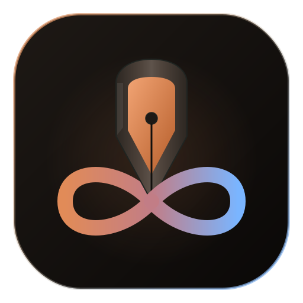

# Werkstatt Infinite

> Premium Android drawing and notebook app. Local-first. Jetpack Compose.


<p align="center">
  
</p>

## Overview

Werkstatt Infinite is a premium Android drawing and bullet-journaling app built with Kotlin, Jetpack Compose, and Room. It focuses on a clean, low-distraction canvas for sketching, notes, and visual journaling — with fast local persistence, a dark void aesthetic, and NODAYSIDLE's Volt accent.

No accounts. No cloud. No clutter.

## Features

- **8 brush types** — Pen, Fine, Ballpoint, Pencil, Marker, Watercolor, Ink, Brush — each with distinct rendering
- **Pressure-aware strokes** — captures Android pointer pressure for natural line weight
- **Pinch-to-zoom and two-finger pan** — fluid viewport transform (0.5×–5× zoom)
- **Grid system** — toggle lines, dots, or off with smart step multiplier at any zoom level
- **Undo / redo** — full stroke-level history
- **Eraser** — spatial-index-backed, fast even with 10,000+ strokes
- **Color wheel + 6 preset palettes** — Bold, Pastel, Earth, Neon, Skin, Vintage
- **Gallery with thumbnails** — auto-generated, sort by date or name, rename, delete
- **Auto-save** — 1.8-second debounce, throttled thumbnail refresh
- **Export** — share drawings through Android share sheets
- **Paper templates** — Blank, Ruled, Dot Grid, Small Grid, Storyboard, Sketch

## Technology

| Area | Technology |
|------|------------|
| Language | Kotlin |
| Interface | Jetpack Compose + Material 3 |
| Architecture | MVVM with StateFlow (UDF) |
| DI | Hilt |
| Storage | Room (SQLite) |
| Serialization | Gson |
| Build | Gradle Kotlin DSL, AGP 8.9.1 |
| Min SDK | 26 · Target SDK 36 |

## Requirements

- Android 8.0 (API 26) or newer
- ~50 MB free space

## Installation

Download the latest APK from [GitHub Releases](https://github.com/nodaysidle/werkstatt-infinite/releases/latest):

```bash
adb install werkstatt-infinite.apk
```

Or transfer the APK to your device and open it.

## Keyboard Shortcuts

| Shortcut | Action |
|----------|--------|
| `Ctrl + Z` | Undo |
| `Ctrl + Shift + Z` | Redo |
| `Ctrl + G` | Cycle grid mode |
| `Ctrl + E` | Toggle eraser |
| `Ctrl + S` | Save now |
| `Back` | Return to gallery |

## Development

```bash
git clone https://github.com/nodaysidle/werkstatt-infinite.git
cd werkstatt-infinite
```

Create `local.properties`:

```properties
sdk.dir=/Users/youruser/Library/Android/sdk
```

Build and test:

```bash
./gradlew assembleDebug
./gradlew test
./gradlew lintDebug
```

Install on device:

```bash
adb install app/build/outputs/apk/debug/app-debug.apk
```

## Architecture

```text
app/src/main/java/com/gift/werkstatt/
  MainActivity.kt              Single Activity entry point
  WerkstattApplication.kt      Hilt application
  core/
    design/                    Theme, colors (dark void + Volt #C8FF00), typography
    navigation/                Type-safe NavHost + routes
  data/
    files/                     Canvas export store, thumbnail store
    local/                     Room entities, DAOs, database + migrations
    repository/                Repository implementation
    serialization/             Gson JSON codec for stroke data
  di/                          Hilt module — Room, Gson, DAOs
  domain/
    canvas/
      model/                   CanvasEntry, Stroke, BrushType, BrushPresets, GridMode, palettes
      repository/              Repository interface
      usecase/                 BuildStroke, EraseStrokes, GetCanvas, SaveCanvas, DeleteCanvas
  feature/
    editor/                    Canvas screen, ViewModel, DrawingCanvas, gesture handler
    gallery/                   Gallery grid, sort, rename, delete dialogs
    templates/                 Paper template picker
  rendering/
    brush/                     StrokeRenderer — 8 brush types, native + Compose paths
    export/                    Canvas-to-bitmap export renderer
    spatial/                   StrokeSpatialIndex — fast hit-testing for eraser
    thumbnail/                 Thumbnail renderer
    transform/                 Pinch-zoom/pan coordinate mapper
```

## Privacy

Werkstatt Infinite is local-first:

- No account system
- No telemetry
- No network calls
- All canvas data stays on-device in Room/SQLite
- No dangerous runtime permissions

## Status

Active — feature-complete drawing and journaling app.

## Contributing

This repository is not currently accepting external contributions.

## License

License not yet specified.
